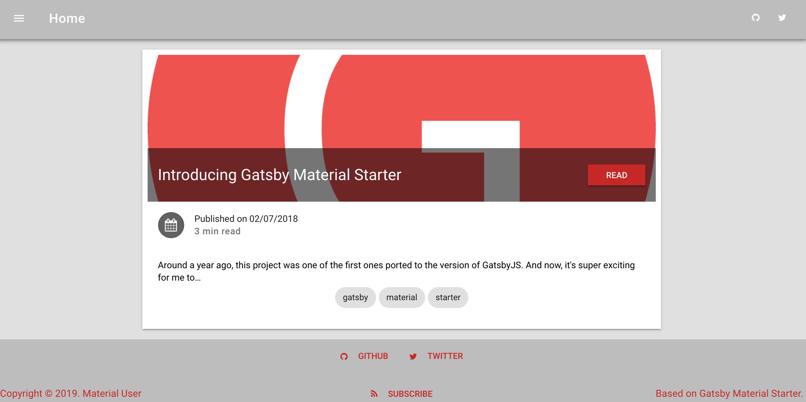

Ecco il mio primo post nel blog realizzato grazie a Gatsby ed ospitato da Github Pages.
Avevo cominciato tanto tempo fà a vedere Github Pages come piattaforma per ospitare il mio blog, mi impegnai seguendo le indicazione e misi in piedi il repository. Allora però lo strumento più in voga per la realizzazione del blog era Jekyll. Essendo io non esperto di Ruby mi cimentai con non poche difficoltà nel metttere in piedi il blog, e alla fine il progetto non prese mai vita.

Diverso tempo dopo, nel tentativo di trovare un'alternativa a Metalsmith, strumento cha avevo usato come generatore del sito web [www.agriturismo-aiole.com](https://www.agriturismo-aiole.com "Agriturismo Aiole") di cui sono webmaster :-), mi sono imbattuto in Gatby.js dopo aver a suo tempo valutato anche altre alternative ( tipo Hugo e DocPad). Essendomi già convinto di puntare la mia attenzione sui generatori basati su node.js rispetto a quelli in Ruby, Java o altri linguaggi, Gatsby faceva proprio al caso mio!
Peccato però che avendo investito parte del mio tempo nell'apprendimento di Angular, mi sono ritrovato a combatttere con un tool che fonda la sua potenza su graphQL e React, due mondi a me sconosciuti e quindi il progetto del blog fù rimesso in soffitta, ma non prima di pubblicare almeno un post, del quale ho conservato uno sceenshot come ricordo.

Ben presto mi pentii anche del gatsby starter utilizzato, con troppi plugin sconosciuti che aggiungevano difficoltà al mio percorso di apprendimento, decisi quindi di ripartire da uno starter minimale, con l'intenzione di arricchirlo mano mano che il mio livello di skill aumentava, ma non aumentò di molto perchè ben presto mi buttai a vedere altre cose ( PWA e ionic in particolare ), perchè ho realizzato che mettersi a studiare qualcosa che poi non si mette in pratica nel lungo periodo non ti lascia molto.
Ma veniamo ai giorni nostri, il coronavirus ci forza allo smart working, a stare in casa per tanto tempo, quale migliore occasione per riprendere qualche vecchio progetto? Tanto più che stò maturando l'idea che possano essere dei validi strumenti da utilizzare anche in ambito lavorativo, sia Gatsby che graphQL come alternativa a REST. Eccomi qui quindi a scrivere il mio primo post, con l'impegno di non lasciarlo solo. La prima cosa che mi impegno a fare è di rivedermi un minimo di documentazione su Markdown per dare a questo primo post un'aspetto migliore... a presto!
